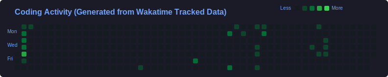

# Hi there, I'm Haythem! 

<a href="https://wakatime.com/@Equanimity" target="_blank">
  
</a>

<div style="display:flex;">
  
  
</div>

```js
let aboutMe = {
  fullName: "Haythem Ben Drissia",
  role: "Frontend Engineer",
  location: "Courbevoie, Hauts-de-Seine, France",
  contact: {
    email: "bendrissiahaythem@gmail.com",
    linkedIn: "https://www.linkedin.com/in/haythem-ben-drissia",
  },
  experience: "4+ years",
  methodologies: ["Agile", "SCRUM"],
  languages: [
    { name: "French", level: "TCF-Q C1" },
    { name: "English", level: "IELTS C1" },
    { name: "Arabic", level: "Native" },
  ],

// Technical Stack
 technicalStack: {
  frontendTechnologies: [
    "Vue.js",
    "Angular",
    "React",
    "TypeScript",
    "JavaScript",
    "SCSS",
    "HTML5",
  ],
  stateManagement: [
    "Redux",
    "NgRx",
    "RxJS",
  ],
  testing: [
    "Jest",
  ],
  toolsAndPlatforms: [
    "Git",
    "GitLab",
    "GitHub",
    "Jira",
    "Confluence",
    "Postman",
  ],
},

// Experience
  recentExperience: [
    {
      company: "ConformIT",
      role: "Frontend Developer",
      years: "2023-2024",
      stack: ["Vue.js", "HTML5", "SCSS", "JavaScript", "Jest"],
      focus: "Developing intuitive user interfaces and responsive web applications",
    },
    {
      company: "VERMEG",
      role: "Frontend Developer",
      years: "2020-2023",
      stack: ["Angular", "TypeScript", "NgRx", "RxJS"],
      focus: "Worked on VEGGO platform and insurance applications",
    },
    {
      company: "GoMyCode",
      role: "Fullstack Developer",
      years: "2020-2023",
      stack: ["React", "JavaScript", "Redux", "MongoDB", "NodeJS", "Express"],
      focus: "Developing GoMyCode's teaching platform",
    },
  ],
};
```
